- I am the CIO [Foresight][fslabs-website] working mainly on the Infra, the CI-CD and the security.
- On the side, I contribute to [Updatecli][updatecli-website], plus a few other stuff

You can reach me on my [email][email] and you can read what I write [here](https://lois.postu.la).

[updatecli-website]: https://www.updatecli.io
[fslabs-website]: https://www.fslabs.ca/
[email]: mailto:gh@postu.la

---

<picture>
  <source media="(prefers-color-scheme: dark)" srcset="github-snake-dark.svg" />
  <source media="(prefers-color-scheme: light)" srcset="github-snake.svg" />
  
</picture>
